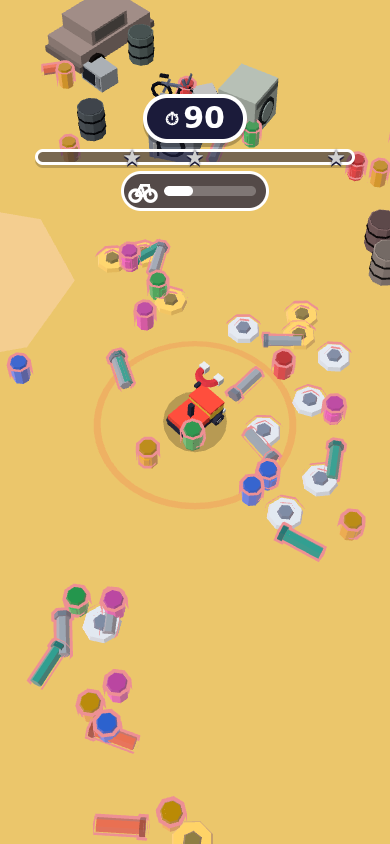
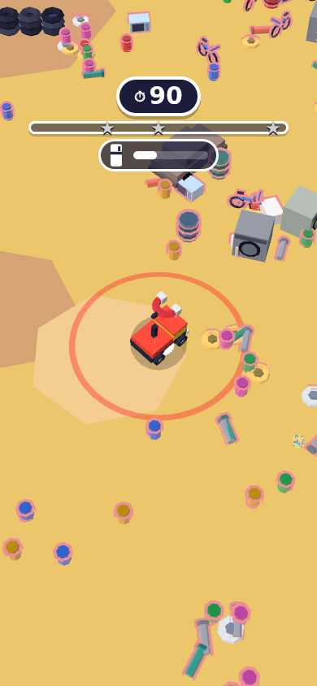
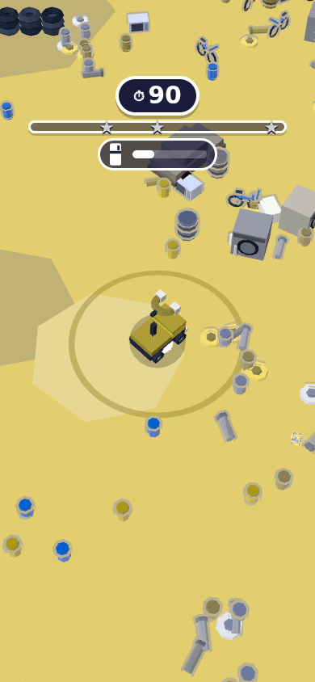
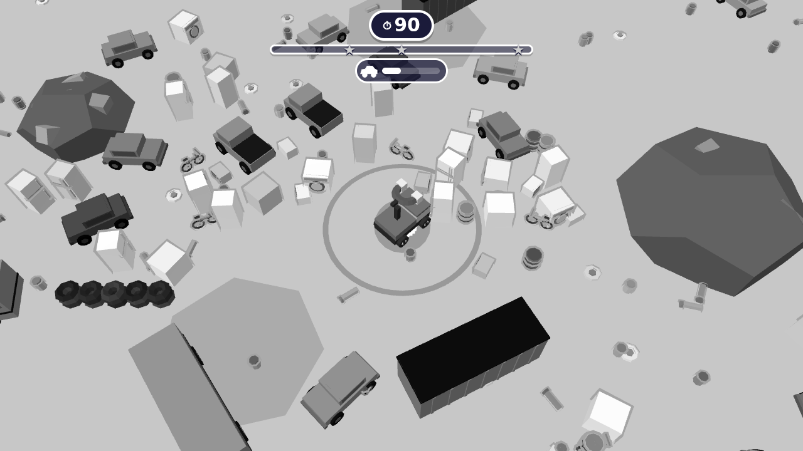
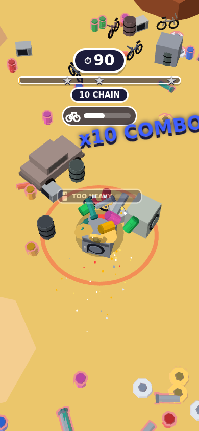
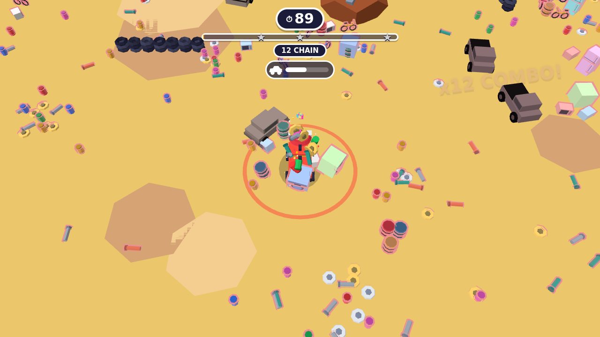

# 🧲 Junk Magnet

A browser game built for Poki. You drive a chunky truck with an oversized
magnet, and junk snaps on with a CLUNK. Every pickup grows your pull, so the
fridge that was too heavy a minute ago is collectable now. Rounds last 90
seconds and award 1–3 stars, and retry is instant.

Stack: **TypeScript + Three.js r180 + Vite**. Physics is custom (no physics engine).
All art is procedural, all audio is synthesized with Web Audio, and the build
ships zero asset files. The design and tech plan is in [`PLAN.md`](PLAN.md).

## Run / build

```bash
npm install
npm run dev        # http://localhost:5173
npm run build      # typecheck + TEST build -> dist/ (keeps ?debug=1, ?bot=1, stats, thumbnails)
npm run preview    # serve dist/ on http://localhost:4173
npm run package    # STRIPPED Poki build (--mode poki) -> junk-magnet-poki.zip (the file you upload to Poki)
npm run thumbnails # render promo thumbnails -> thumbnails/*.png (see below)
```

## Submitting to Poki
`npm run package` produces `junk-magnet-poki.zip` (≈161 KB) with `index.html`
at the zip root. Every path is relative (`base: './'`), so it runs from any
sub-path or iframe.

**Done in code (verified in tests):**
- The SDK loads automatically on any `*poki*` host. It is skipped if Poki has
  already injected `window.PokiSDK`.
- The SDK runs `init` → `gameLoadingFinished`, and `gameplayStart` fires on the
  first input. It never fires twice in a row, and no ad is ever requested while
  gameplay is running.
- Rewarded ads use the current `rewardedBreak({ size, onStart })` form (sizes are
  listed in the ad table below). A reward is granted only when the SDK resolves
  `true`.
- **On a Poki host where the SDK fails to load** (adblock or network), the game
  plays on with no ads: commercials are skipped and rewarded offers grant
  nothing. The local fake-ad mock **never** appears there.
- The game shows on its first frame and never waits on the ad SDK. A tap that
  arrives before the SDK is ready is queued as `gameplayStart`.
- Production builds print nothing to the console.
- **No external requests and no analytics.** The only network request outside the
  game's own files is the Poki SDK script, which loads only on Poki hosts. There
  are no CDNs, web fonts, remote assets or telemetry; the game's audio is synthesized.
  This was verified with a network log of full sessions; see *Pre-submission checks*.
- Arrow keys and space never scroll the page, there are no external links, and
  no other ad networks are used.

**Still yours to do before/at upload:**
1. **Real-device check.** Play a few rounds on a mid-range Android phone and an
   iPhone with `?debug=1` and confirm ~60 fps (the sandbox had no GPU). Load the
   page with `?sdk=poki` to exercise the real SDK in its debug mode.
2. Review Poki's current [integration requirements](https://sdk.poki.com/new-requirements)
   (they change; I could not fetch that page from the build sandbox).
3. Create the game in Poki for Developers, upload `junk-magnet-poki.zip`, and run
   their Playtest/QA tooling.
4. Store art (title, description, thumbnails) is needed for public release, not
   for the Playtest stage. See the Phase 2 note on a rendered 512×512 thumbnail.
5. Keep the game off public URLs (Poki deals are web-exclusive): see *Pre-submission checks*.

### Useful URL params
These work in the test build (`npm run dev` / `npm run build`). The Poki build
(`npm run package`) compiles out every debug and test switch below, along with the bot,
the overlay, the fps counter, per-round stats, config overrides and the thumbnail tool
(`src/dev/devtools.ts` and every `__STRIP__` guard). Only the ad-mock switches (`?adfail`,
`?adcooldown`, `?sdk=poki`) remain, because the SDK wrapper is shared.

| Param | Effect |
|---|---|
| `?debug=1` | Debug overlay (FPS, draw calls, growth and readability stats; local only, nothing is recorded or sent). Also exposes `window.__game`. |
| `?debug=1&cfg.round.length=30&cfg.magnet.baseRadius=4` | Override any numeric/boolean value in `src/config.ts` without touching code (also enabled by `?tune=1`). |
| `?bot=1&skill=novice\|average\|skilled` | Autopilot that plays like a player at three skill levels. All of them only "see" junk that is **on screen**. **novice**: ~400ms reactions, sloppy aim, follows the arrow half the time, gets distracted. **average** (default): chases the nearest visible junk, follows the arrow, else wanders. **skilled**: instant reactions, keeps combo chains alive, routes toward dense and valuable clusters, remembers where junk is. Used for balance measurement and automated tests. |
| `?debug=1&speed=N` | Simulate N× faster than real time (max 16), for quick bot measurements. |
| `?thumb=1&sizes=512,1080` | Thumbnail render mode (used by `npm run thumbnails`). |
| `?adfail=1` | Mock: every rewarded ad fails. Tests the "no reward" path. |
| `?adcooldown=N` | Mock: commercial-break frequency cap in seconds (default 45, mimicking Poki). |
| `?sdk=poki` | Force-load the real Poki SDK when not on a Poki domain (falls back to no-ads if it can't load). |

## Pre-submission checks (Phase 1 upload)
These were run on the production build in headless Chromium. Poki's requirements page
(`sdk.poki.com/requirements`) is blocked from the build sandbox, so the checks follow
the requirement list given in the pre-submission brief.

| Check | Result | Evidence |
|---|---|---|
| Debug code stripped from the Poki build | ✅ | `npm run package` builds with `--mode poki`. A scan of the zip finds no bot, overlay, fps, stats, config-override or thumbnail code. With `?debug=1&bot=1&cfg.round.length=5&thumb=1` the Poki build shows no overlay, exposes no test globals, does not autoplay and keeps 90 s rounds. |
| Stripped-build regression | ✅ | An input-only suite (keyboard, tap, buttons; no test hooks) ran on desktop and phone and passed 40 checks on each. It covers the SDK order, all 6 rewarded placements with rewards granted, the garage, skin try, Mega Magnet, Rush with continue, daily, hide/show, the no-SDK fallback and save persistence. |
| Full regression (test build) | ✅ 22/22 pass | 14 game-flow and 8 Poki SDK checks. They cover the core loop, all 6 rewarded placements, the skin try, Mega Magnet, continue, daily, save and hide/show, the SDK call order, the no-SDK fallback, and no fake ad UI on Poki hosts. |
| Zero network calls except the Poki SDK | ✅ | Network log of full sessions on desktop and phone: a plain keyboard session, and a scripted session through every screen and a rewarded flow. It ran across 9 viewports plus a forced Poki-SDK load. Result: 42 same-origin requests, 1 external (`game-cdn.poki.com/scripts/v2/poki-sdk.js`), no websockets. The bundle contains no other URL. |
| In-game analytics removed | ✅ | `src/core/analytics.ts` and every tracking call deleted. |
| Canvas fills the screen | ✅ | The canvas is the full viewport with no scroll at 16:9 desktop sizes from 640×360 to 1920×1080, in phone portrait and landscape, and on tablets in both orientations. It renders at device pixel ratio, capped at 1.5 on mobile. |
| Initial download < 8 MB | ✅ | 160 KB gzipped (599 KB raw) for the Poki build. |
| Mobile controls on tablets; desktop instructions | ✅ fixed | Drag-to-steer works on every device with no detection needed. The first-round hint now reads "Click & drag, or WASD / arrow keys" on mouse devices and "Drag to steer" on touch devices, including iPads. |
| Standard button ≥ reward button (6 placements) | ✅ | Measured on the Poki build, desktop and phone. Play (398×66 desktop, 334×68 phone) beats extra time, ×3 coins, Mega Magnet and continue run (at most 398×52 / 324×52). In the garage the coin-buy button is **52 px** tall against **40 px** for the ad button at the same width, for free upgrade and skin try. |
| No branding, external links or other ads | ✅ | No `<a>` links in the build and no other ad network. |
| Poki SDK events | ✅ | `init` → `gameLoadingFinished` → `gameplayStart` on first input, `gameplayStop` before every ad and at round end, no duplicates. `rewardedBreak({size, onStart})`. |
| Real-phone performance | ❌ not done | No physical devices are available to the build sandbox. Needs a person; see the report. |
| Off public URLs | ❌ public on request | The test build is live again at https://piratekinginc.github.io/test-m10/ for a user test and portfolio. **Before the Poki upload:** delete `.github/workflows/pages.yml`, empty or delete `gh-pages`, turn Pages off and make the repo private. |

### Changelog since the last real-player test
- **Size = power:** the truck grows with lift capacity, with a power-up pop at each new tier.
- **Liftable at a glance:**
  - liftable junk gets a bright outline and leans toward the truck;
  - too-heavy junk is desaturated and darker, and bumping it gives a clank and a "TOO HEAVY" pop with a progress bar;
  - a newly liftable tier flashes, with "NOW LIFTING …!".
- **HUD and ring:** the HUD shows the next tier's icon with a progress bar. The pull-radius ring is fainter and pulses on each pickup.
- **Models:**
  - fridges and washers are 25% bigger and bikes slightly shorter, so each tier is visibly bigger than the last;
  - pickup reach is unchanged.
- **Driving:**
  - big trucks can climb ramps;
  - Suburb street ramps are now two-sided humps that still launch the truck;
  - collision is capped at 1.25× the original growth curve so yards stay reachable.
- **Camera** starts closer while the truck is small.
- **Desktop** shows mouse and keyboard instructions.
- **Removed:**
  - in-game analytics (Poki dashboard and recordings instead);

## Final bundle size
The Poki upload build (`npm run package`, debug tooling compiled out):

| File | Raw | Gzip |
|---|---|---|
| `assets/index-*.js` (game + three.js) | 586 KB | 156 KB |
| `assets/index-*.css` | 11.6 KB | 3.3 KB |
| `index.html` | 1.6 KB | 0.8 KB |
| **Total** | **≈ 599 KB** | **≈ 160 KB** (zip: 161 KB) |

The test build (`npm run build`) is about 11 KB larger: it adds the bot, the debug
overlay and the lazily loaded thumbnail renderer.

That is well under the 5 MB target, with no images, models or audio files.
Under 4× CPU throttling, a 4G-like network profile and software WebGL (headless
Chromium), the game was **playable after ~1.5 s** and the first combo landed
before any input.

## MVP scope shipped (Phase 1)
- **Core loop**: drag/hold steering (floating virtual joystick) plus WASD/arrows.
  A spatial-hash junk system with 12 junk types in 5 size tiers (cans → bikes/drums
  → fridges/washers → cars/pickups → containers/buses). Items that are slightly
  too heavy wobble and strain. Liftable ones teeter, hop, fly in an eased arc and
  snap onto a growing Katamari-style pile on the truck. Big pieces compact as they
  join so the pile stays readable.
- **Growth**: capacity, pull radius, pile size, truck size and magnet size all scale
  up, and the camera zooms out smoothly. A "NOW LIFTING CARS!" moment plays when
  each new tier unlocks.
- **Juice**: squash & stretch, hit-stop on large/huge pickups, trauma-based screen
  shake, instanced particles, combo pop-ups, clunk pitch rising with the combo,
  pentatonic combo chimes, a radius ring pulse and landing thuds.
- **Levels**: **Junkyard** (scrap mounds, tire walls, crane) and **Suburb** (houses,
  garages with ramps up to junk-loaded roofs, street jump ramps with ×1.25 air pull
  and ×2 air-grab score). Suburb unlocks with 1★ in Junkyard.
- **Scrapyard Rush** (endless): 45s clock that drains faster as the run goes on,
  combos add time (capped per chain), and junk drops from the sky in waves sized to
  your current strength. One "continue run" per run.
- **Daily challenge**: seeded by date (theme alternates) with a fixed goal ("Clean
  55% of the Junkyard" / "Lift 3 cars"). The first clear each day pays +200 coins.
- **Meta**: coins, 3 upgrades × 5 tiers (Magnet Power = pull radius + lift capacity, truck speed, +time), 2 skins
  (Classic; Monster costs 450 coins or can be tried for one round via an ad).
- **Saves**: versioned localStorage (stars, coins, upgrades, free-upgrade usage,
  skins, best scores/% per mode, daily status, mute, stats). Every access is wrapped
  in try/catch and merged with defaults.
- **Poki SDK + mock**, **debug overlay**, and a
  **single config file** (`src/config.ts`).

### Code map
```
src/config.ts          every tunable (round length, density, tiers, costs, ad rewards, combo, juice, camera, perf caps)
src/core/sdk.ts        Poki SDK v2 wrapper + local mock + no-ads fallback (lifecycle guards, audio mute during ads)
src/core/audio.ts      Web Audio synth: sfx + 16-step music loop
src/core/input.ts      one-input steering
src/core/save.ts       localStorage persistence
src/game/game.ts       round lifecycle, scoring, growth, rewarded grants
src/game/junk.ts       instanced junk, spatial grid, pickup state machine, pile
src/game/junkTypes.ts  procedural junk catalog
src/game/levels.ts     level defs, heightfield solids, layout generation, daily
src/game/features.ts   per-level feature registry (Rush waves; Phase 2 hooks)
src/game/truck.ts      truck model/skins, driving over the heightfield, ramps
src/game/effects.ts    particles + camera rig (zoom, shake)
src/ui/ui.ts           HUD, end screen hub, Garage, Modes
src/ui/debug.ts        ?debug=1 overlay (test build only)
src/dev/devtools.ts    test-build tooling: bot driver, fps, per-round stats, debug pose (compiled out of the Poki build)
src/game/assist.ts     adaptive anti-dead-time assists: sky drop, magnet pulse, off-screen arrow
src/game/bot.ts        ?bot=1 autopilot with novice / average / skilled profiles (measurement only)
                       size = power + liftable outline / too-heavy tint: Game.visualScaleFor, junk.ts (makeStateMaterial, makeOutlineMaterial)
src/game/thumbnail.ts  promo thumbnail staging + rendering (loaded only with ?thumb=1)
scripts/thumbnails.mjs npm run thumbnails: Vite + headless Chromium -> thumbnails/*.png
```

## Poki SDK integration and every ad placement

Lifecycle: `PokiSDK.init()` → (first frame rendered) `gameLoadingFinished()` →
the player's **first input** triggers `gameplayStart()`. If the player taps
before the SDK has loaded, the call waits until it has. `gameplayStop()` fires at
time-up, before every ad, and when the tab is hidden; `gameplayStart()` fires on
resume. All game audio is muted (the AudioContext is suspended) for the entire
duration of every ad.

| # | Placement (`placement` id) | Type | Where / when it fires | Reward (only if SDK returns `true`) | Limit | Poki `size` |
|---|---|---|---|---|---|---|
| – | `commercialBreak()` | Interstitial | Before **every** round start after the boot round: Play Again, Next Level, mode select, Play from the Garage, and the start following any rewarded offer (Poki decides whether an ad actually shows) | – | Poki-controlled | – |
| 1 | `mega_magnet` | Rewarded | End-screen button "Next round with MEGA MAGNET" (the round-start decision) | ×2 pull radius + lift a tier early, for 20s | Every round | medium |
| 2 | `extra_time` | Rewarded | End screen of level/daily rounds, "+20 seconds" | Resumes the same round with 20s | Once per round | medium |
| 3 | `triple_coins` | Rewarded | End screen, "x3 coins" | +2× the round's coins | Once per round | medium |
| 4 | `upgrade_free` | Rewarded | Garage, "Free" under each upgrade | That upgrade tier for free | Once per upgrade tier | large |
| 5 | `skin_try` | Rewarded | Garage, "Try 1 round" on locked skins | Next round starts with that truck, then it reverts | Every time | small |
| 6 | `continue_run` | Rewarded | End screen of Scrapyard Rush, "Continue run (+25s)" | Resumes the run with 25s | Once per run | large |

Sizes live in `REWARD_SIZE` in `src/ui/ui.ts`.

Every rewarded button is optional, and **Play** is always the largest button.
A failed or closed ad shows a friendly toast and grants nothing (verified with
`?adfail=1` and the mock's close button).

In portrait on mobile, `--safe-top` / `--safe-bottom` = 90px keep the HUD,
hint and all panels out of the banner zones.

## Analytics
**None in the build.** Poki blocks external requests by default and always blocks
Google Analytics, so the in-game event bus was removed. Player data comes from
the Poki dashboard and playtest recordings.

For balance work, `game.lastRoundStats` and the `?debug=1` overlay still compute
per-round numbers locally: % cleaned, stars, coins, droughts, the assisted-pickup
share, and the readability stats (`bonks`, `bonkRate`, `firstPickupT`,
`tierUnlockT`, `steerLiftPct`). The bot harness reads them. They never leave the
page.

## Testing done
I drove the game in headless Chromium (Playwright, software WebGL) at every stage:
- Desktop 1280×720 and phone portrait 390×844 (touch drag), checked with screenshots.
- Full flow script, all passing: SDK call order, `gameplayStart` on first input,
  `gameplayStop` at time-up, each of the 6 rewarded placements granting
  correctly and respecting its limit, the failed-ad path, coins/free upgrades,
  skin try reverting after one round, Suburb unlock, ramp launches (airborne,
  y≈1.7), Rush continue, Daily round, visibility pause/resume, and save
  persistence across reload. There were zero console errors.
- Poki launch checks, all passing:
  - **SDK stub:** a stand-in for the real SDK recorded the exact call sequence
    (`init | gameLoadingFinished | gameplayStart | gameplayStop |
    rewardedBreak:{"size":"medium","onStart":fn} | … | commercialBreak |
    gameplayStart`). There were no double starts and no ad calls during gameplay.
  - **SDK blocked on a Poki host:** the game was visible in ~1.1s, no fake ad UI
    appeared, and rewarded offers granted nothing.
  - **Production build:** silent console.
- **Difficulty retune:** 3 bot skills × 2 levels × 5 progression runs, before and
  after, from fresh saves with upgrades bought between rounds (see *Difficulty
  retune*). The full flow and Poki SDK suites were re-run afterwards; all pass.
- **Balance runs with `?bot=1`**, before the assists, with an earlier omniscient bot that plays far better than a new human:
  - Junkyard, no upgrades: smalls liftable by ~10s, fridges ~15s, cars ~20s, containers ~50s.
  - Junkyard result: 89% cleaned, ~207 coins.
  - Rush: a strong run lasts ~65–90s and scores ~43k.

## Late-round dead time: assists and measurements

**Goal:** once the local area is cleared, a player should never drive more than
~3s without a pickup opportunity.

### The three mechanics (current, adaptive version)
Each mechanic lives in `src/game/assist.ts`, and every threshold is in `CONFIG.assist`.
The values below are the shipped defaults after the difficulty retune (see
*Difficulty retune* below). The measurements in this section were taken with the
first, fixed-delay version.

| | Mechanic | How it works now |
|---|---|---|
| **A** | **Sky drop** (`assist.skyDrop`) | **Adaptive trigger:** nothing picked up for 1.6s (healthy players) down to 1.0s (struggling players), and fewer than 4 liftable items within the pulse's reach. 7 items fall in, taken from the **far corners** of the map. About **45% are one tier ABOVE what you can lift**, so drops create goals, not just free pickups. They land 4–10 units ahead of the truck, or anywhere around it if it faces a wall. A growing shadow telegraphs each one (fall ≈0.7s), and it lands with a thud and dust and no bounce. Junk is **relocated, never created**. 1.2s cooldown. |
| **B** | **Magnet pulse** (`assist.pulse`) | **Adaptive trigger:** 2.5s without a pickup for healthy players, down to 1.5s for struggling ones. A shockwave yanks up to 6 liftable items within (2 × pull radius × (1 + 15% per Magnet Power tier) + 5), so **upgrades make the pulse stronger**. Pulled junk flies in fast. 2.5s cooldown. It auto-triggers because hold already means "steer" (one-input rule). |
| **C** | **Off-screen arrow** (`assist.arrow`) | Shows only after **2s** with nothing liftable on screen and no drops incoming. It points to the densest reachable cluster **on the truck's level**. |
| + | **Early end** (`round.endWhenCleared` / `endWhenStuck`) | Nothing liftable left **and 3★ earned**: **CLEARED!**, +400 points and +2 coins per second left. Nothing liftable left **without** 3★: **OUT OF REACH!** ends the round with no bonus and a "upgrade your magnet" nudge, so the player is never stranded. Not used in Rush. |

"Struggling" is measured from **player** pickups only (assisted ones don't count)
over the last 15s. At 6/s or more, assists use their slow base delay; at 2/s or
less, they use the fast minimum (`assist.adaptive`). Bots average 3–6 pickups/s,
because one sweep through a cluster lifts many items.

### How it was measured
- `?bot=1` plays each round. The bot is **vision-limited**: it sees only on-screen
  junk, follows the arrow when that flag is on, and otherwise wanders. An
  omniscient bot would make the arrow pointless to measure.
- Each run is a fresh save (no upgrades) at `speed=6`.
- **Metrics** (from `lastRoundStats`): pickups in the final 30s, mean and max
  gap between pickups, the number of gaps over 3s, and total seconds spent beyond
  3s, plus % cleaned.
- **Scenarios:** Junkyard on desktop landscape (720×405), and Suburb in phone
  portrait (390×844). Suburb is the hard case: houses, roofs and a narrower view.

**Round 1: every combination, first-pass tuning** (Junkyard, 3 runs each)

| Config | % cleaned | Average longest drought | Worst run | Seconds stuck past 3s |
|---|---|---|---|---|
| baseline | 85.0 | 4.99s | 6.9s | 2.9 |
| A | 84.5 | 4.81s | 6.9s | 2.3 |
| B | 90.9 | 5.47s | 7.0s | 4.0 |
| C | 90.8 | 4.96s | 6.0s | 3.4 |
| AB | 94.7 | 3.43s | 3.9s | 0.7 |
| AC | 88.4 | 4.30s | 6.3s | 2.5 |
| BC | 97.9 | 7.22s | 11.0s | 4.8 |
| **ABC** | 91.3 | **2.87s** | **3.5s** | **0.2** |

**Round 2: Suburb portrait, after fixing the arrow's level check** (4 runs each)

| Config | % cleaned | Average longest drought | Worst run | Seconds stuck past 3s |
|---|---|---|---|---|
| baseline | 63.6 | 4.59s | 7.0s | 3.3 |
| B | **80.4** | 3.38s | 4.6s | 1.4 |
| C | 55.1 | 3.95s | 6.7s | 1.8 |
| AB | 74.3 | 3.72s | 3.8s | 0.9 |
| BC | 69.2 | 3.86s | 5.9s | 2.2 |
| **ABC** | 78.2 | **3.34s** | **3.7s** | **0.6** |

**What the data says:**
- **ABC** gave the best worst-case result in both scenarios.
- No single mechanic is enough on its own:
  - The arrow alone just points at junk that may still be far away.
  - The pulse alone fires into empty space when the area is truly dry.
  - The drop alone is too slow on its own because of its fall time.
- **Then tuned:** quicker triggers (drop at 0.4s idle and fewer than 6 nearby, pulse at 1.0s / 3s cooldown).
  This took Suburb to a worst run of 2.9s. Junkyard still showed 5s gaps; the logs
  showed the bot had **cleaned ~98% of the map**, so nothing was left to drop or
  pull. That led to the **early clear** rule.

### Before / after (shipped defaults, 5 runs each)

| Scenario | Version | % cleaned | Pickups in final 30s | Average longest drought | Worst run | Gaps over 3s | Seconds stuck past 3s |
|---|---|---|---|---|---|---|---|
| Junkyard, desktop | before (all off) | 86.8 | 119.6 | 6.73s | 12.2s | 1.8 | 4.2 |
| Junkyard, desktop | **after** | **99.9** | **161.0** | **2.37s** | **2.8s** | **0** | **0** |
| Suburb, phone portrait | before (all off) | 40.0 | 93.6 | 9.97s | 20.6s | 1.6 | 7.8 |
| Suburb, phone portrait | **after** | **77.8** | **146.2** | **2.82s** | **2.9s** | **0** | **0** |

Every measured run now stays under the ~3s target.

This first version made the game too easy: the bot cleared Junkyard and got 3★
with no upgrades. The **Difficulty retune** section below fixes that while keeping
droughts ≤ 3.5s.
To reproduce: `?debug=1&bot=1&speed=6&cfg.assist.pulse.enabled=false`, and so on.

## Difficulty retune: adaptive assists, skill rewards, progression

**Problem:** after the dead-time work, the game partly played itself. The bot
cleared Junkyard and got 3★ on its first run with no upgrades, and the magnet
pulse fired after only 1s. **Goal:** assists rescue struggling players without
carrying skilled ones, stars and upgrades matter, and no player is stuck more
than ~3.5s.

### What changed
- **Three bot skill levels** (`?bot=1&skill=novice|average|skilled`; see URL params,
  code in `src/game/bot.ts`). Every measurement below uses all three.
- **Adaptive assists** (`CONFIG.assist`):
  - **Pulse:** fires after 2.5s without a pickup, shortening toward 1.5s only when
    the player's own pickup rate over the last 15s is low. Its reach grows 15% per
    Magnet Power tier.
  - **Sky drops:** use the same adaptive trigger (1.6s → 1.0s). About 45% of each
    drop is junk **one tier above** what you can lift.
  - **Arrow:** shows only after 2s with nothing liftable on screen.
- **Skill rewards** (`CONFIG.combo`, `CONFIG.economy`):
  - **Combo multiplier on score and coins:** x1 → **x2 at a 15-chain** → **x3 at a
    40-chain**, with a 0.4s window.
  - **Visible:** a HUD chain pill ("15 CHAIN · x2") plus a "x2 MULTIPLIER!" pop.
  - **Audible:** a rising arpeggio on each tier-up, on top of the per-pickup clunk
    pitch climb.
  - **Assisted pickups** (from a pulse or a sky drop) **never extend the combo**,
    earn **25% coins** and **50% score**.
  - **End screen:** "Combo N · Best combo M (NEW!)" next to score and best score.
- **Early endings:**
  - **CLEARED!** now needs 3★ earned that round. It pays +400 score and +2 coins
    per second left (was +150 score).
  - Running out of liftable junk **without** 3★ ends the round as **OUT OF
    REACH!**, with no bonus and an upgrade nudge, so nobody drives around an empty
    map.
  - Both are tracked: `earlyEnd` and `secondsLost` in `lastRoundStats`.
- **Progression** (`CONFIG.magnet`, `CONFIG.upgrades`, `levels.ts`):
  - Slower natural growth: pull radius +0.10 per √mass (max 9), lift capacity
    0.07 per mass.
  - About 30% more junk per level.
  - The magnet upgrade is now **Magnet Power: +30% pull radius and +35% lift
    capacity per tier**. Speed is +12% per tier, Time +8s per tier.
  - Costs are flattened to roughly one round of coins: 90–420 per tier. Magnet Power is the cheapest at every tier, because it is the upgrade that opens 3★.
  - Coins are 0.06 per junk value × combo multiplier, plus star coins.
  - **Stars:** Junkyard **30 / 50 / 95%**, Suburb **25 / 50 / 85%**. Containers
    are ~17% of a map and need real lift capacity, so 3★ effectively requires a
    strong run **or** Magnet Power upgrades.
- **Bug fixed along the way:**
  - **Ramp catapult:** the frame loop could run a tiny final physics sub-step,
    turning a ramp lip into a launch that threw the truck tens to hundreds of
    units into the air. It is real-device reachable at ~20–30 fps, and it caused
    the 5–6s Suburb droughts in the **before** build. The fix uses equal
    sub-steps plus a clamped slope speed.
  - **Drop landing spots:** sky drops can now land anywhere around the truck when
    it faces a wall.

### How it was measured
- **Harness:** `?bot=1&skill=…&speed=10`, driven by a progression script.
- **Starting state:** each run starts from a **fresh save** and plays up to 8
  rounds, buying the cheapest affordable upgrades between rounds, until it earns
  3★.
- **Scenarios:** Junkyard on desktop (720×405) and Suburb in phone portrait
  (390×844), 5 runs per skill.
- **"Before":** the previously shipped build with the same bots. It still had the
  ramp-catapult bug and lacked a small anti-stuck tweak added to the bots later.
- **"Longest drought"** is the longest gap between pickups over the **whole
  round**.
- **"Rounds to 3★"** counts the round in which 3★ was first earned.

### Junkyard (desktop)

**BEFORE: Junkyard, desktop** (first round on a fresh save, 5 runs per skill)

| Skill | % cleaned | Stars (avg) | ★ distribution 0/1/2/3 | Coins | Longest drought avg (worst) | Assisted pickups | Best combo | Round length | Rounds to 3★ (mean, reached) | Upgrade tiers owned at 3★ |
|---|---|---|---|---|---|---|---|---|---|---|
| novice | 90.8 | 2.4 | 0/0/3/2 | 166 | 2.9s (3.3s) | 35.2% | 72.0 | 87.9s | 1.6 (5/5) | 1.2 |
| average | 98.0 | 3.0 | 0/0/0/5 | 190 | 2.8s (3.1s) | 30.2% | 88.0 | 89.0s | 1.0 (5/5) | 0.0 |
| skilled | 99.7 | 3.0 | 0/0/0/5 | 211 | 2.9s (3.2s) | 26.7% | 114.0 | 77.0s | 1.0 (5/5) | 0.0 |

| Skill | Rounds played | Ended early (cleared / stuck) | Avg seconds lost when early | Max drought, all rounds | Rounds with a drought > 3.5s | Avg coins per round |
|---|---|---|---|---|---|---|
| novice | 8 | 3 / 0 | 5.7s | 3.3s | 0 | 176 |
| average | 5 | 2 / 0 | 2.6s | 3.1s | 0 | 190 |
| skilled | 5 | 3 / 0 | 21.8s | 3.2s | 0 | 211 |

**AFTER: Junkyard, desktop** (first round on a fresh save, 5 runs per skill)

| Skill | % cleaned | Stars (avg) | ★ distribution 0/1/2/3 | Coins | Longest drought avg (worst) | Assisted pickups | Best combo | Round length | Rounds to 3★ (mean, reached) | Upgrade tiers owned at 3★ |
|---|---|---|---|---|---|---|---|---|---|---|
| novice | 46.8 | 1.4 | 0/3/2/0 | 97 | 2.8s (3.0s) | 23.3% | 48.6 | 90.0s | 5.0 (5/5) | 4.8 |
| average | 67.5 | 1.8 | 0/1/4/0 | 175 | 3.0s (3.0s) | 10.5% | 101.4 | 90.0s | 3.8 (5/5) | 4.2 |
| skilled | 81.2 | 2.2 | 0/0/4/1 | 215 | 2.9s (3.0s) | 12.9% | 103.0 | 90.0s | 2.2 (5/5) | 2.0 |

| Skill | Rounds played | Ended early (cleared / stuck) | Avg seconds lost when early | Max drought, all rounds | Rounds with a drought > 3.5s | Avg coins per round |
|---|---|---|---|---|---|---|
| novice | 25 | 1 / 0 | 1.2s | 3.1s | 0 | 183 |
| average | 19 | 3 / 0 | 7.9s | 3.0s | 0 | 231 |
| skilled | 11 | 3 / 0 | 4.3s | 3.0s | 0 | 250 |

### Suburb (phone portrait)

**BEFORE: Suburb, phone portrait** (first round on a fresh save, 5 runs per skill)

| Skill | % cleaned | Stars (avg) | ★ distribution 0/1/2/3 | Coins | Longest drought avg (worst) | Assisted pickups | Best combo | Round length | Rounds to 3★ (mean, reached) | Upgrade tiers owned at 3★ |
|---|---|---|---|---|---|---|---|---|---|---|
| novice | 74.8 | 2.2 | 0/0/4/1 | 124 | 2.9s (3.0s) | 43.8% | 46.0 | 90.0s | 3.4 (5/5) | 3.0 |
| average | 77.2 | 2.0 | 0/0/5/0 | 124 | 2.9s (2.9s) | 44.8% | 48.2 | 90.0s | 3.2 (5/5) | 3.2 |
| skilled | 93.1 | 2.8 | 0/0/1/4 | 182 | 3.0s (3.0s) | 38.3% | 82.8 | 90.0s | 1.2 (5/5) | 0.4 |

| Skill | Rounds played | Ended early (cleared / stuck) | Avg seconds lost when early | Max drought, all rounds | Rounds with a drought > 3.5s | Avg coins per round |
|---|---|---|---|---|---|---|
| novice | 17 | 1 / 0 | 3.7s | 5.0s | 2 | 135 |
| average | 16 | 2 / 0 | 2.8s | 6.3s | 1 | 143 |
| skilled | 6 | 2 / 0 | 0.7s | 3.0s | 0 | 185 |

**AFTER: Suburb, phone portrait** (first round on a fresh save, 5 runs per skill)

| Skill | % cleaned | Stars (avg) | ★ distribution 0/1/2/3 | Coins | Longest drought avg (worst) | Assisted pickups | Best combo | Round length | Rounds to 3★ (mean, reached) | Upgrade tiers owned at 3★ |
|---|---|---|---|---|---|---|---|---|---|---|
| novice | 38.1 | 1.2 | 0/4/1/0 | 65 | 2.6s (2.8s) | 27.8% | 34.8 | 90.0s | 7.2 (5/5) | 5.2 |
| average | 44.6 | 1.0 | 0/5/0/0 | 85 | 2.8s (3.0s) | 22.5% | 49.4 | 90.0s | 4.6 (5/5) | 3.8 |
| skilled | 42.8 | 1.0 | 0/5/0/0 | 76 | 2.7s (3.0s) | 24.6% | 51.2 | 90.0s | 3.6 (5/5) | 2.6 |

| Skill | Rounds played | Ended early (cleared / stuck) | Avg seconds lost when early | Max drought, all rounds | Rounds with a drought > 3.5s | Avg coins per round |
|---|---|---|---|---|---|---|
| novice | 36 | 0 / 0 | – | 3.0s | 0 | 144 |
| average | 23 | 0 / 0 | – | 3.0s | 0 | 169 |
| skilled | 18 | 0 / 0 | – | 3.0s | 0 | 171 |

### Scorecard against the targets

| Target | Result | Status |
|---|---|---|
| Junkyard first run: novice ~1★ | 1.4★ (3 runs at 1★, 2 at 2★); 1.5★ pooled over 26 fresh runs | ⚠️ slightly generous |
| Junkyard first run: average ~2★ | 1.8★ (4 of 5 at 2★); 1.9★ pooled over 26 | ✅ |
| Junkyard first run: skilled 3★ in < 20% of runs | 1 of 5 runs (20%); 4 of 26 pooled fresh runs (15%) | ✅ (borderline) |
| Junkyard: average reaches 3★ with ~2–3 upgrade tiers | 4.2 tiers on average (3★ by round 3.8; range 3–5 tiers) | ⚠️ ~1 tier over |
| Suburb: average needs ~3–5 rounds of upgrades for 3★ | 3★ by round 4.6 with 3.8 tiers (range 2–6 rounds) | ✅ |
| About one upgrade affordable per round | average earns ~165–200 coins per round against tiers costing 90–420 | ✅ |
| No player stuck > ~3.5s | worst 3.1s across all 132 after-rounds (55 Junkyard + 77 Suburb), 0 over 3.5s. Before: up to 6.3s in Suburb, caused by the ramp-catapult bug | ✅ |
| Novice droughts < ~3.5s | worst 3.1s (Junkyard) / 3.0s (Suburb) | ✅ |
| Average earns ≥ 1★ on the first Junkyard run | 5 of 5, and 26 of 26 pooled (lowest 36.5% vs the 30% line) | ✅ |
| Assists stop carrying players | assisted share of pickups fell from 27–45% before to 10–28% after; assisted pickups earn ¼ coins and never extend combos | ✅ |

**Honest caveats:**
- **The bots overlap.** On the open Junkyard map the novice and average bots
  clean similar amounts (median ~51% vs ~58% over the pooled fresh runs), because
  the magnet does much of the work. The 2★ line at 50% is the best split
  available: it gives average ~1.9★ and novice ~1.5★ pooled over 26 fresh runs
  each.
  Real novices will likely spread further apart than the bot does.
- **Five runs per skill is a small sample.** Single runs swing 30+ percentage
  points, because whether a run snowballs into cars and containers is
  threshold-like. Treat these numbers as direction, and calibrate stars from
  Player Fit Test data and playtest recordings. Every value is in `config.ts` and `levels.ts`.
- **The bots never use ads.** Rewarded upgrades and Mega Magnet make every
  progression path faster for real players than shown here.
- **The 3★ line is a trade-off.** Scored post-hoc on the same runs, a 90% line
  would cut average's path to ~3.4 upgrade tiers but let skilled 3★ about a third
  of fresh Junkyard runs. 95% keeps 3★ an earned goal. If Player Fit Test data
  shows average players stalling, raise `upgrades.magnet.liftPerLevel` before
  lowering the line.

## Playtest round 1: "what can I pick up?"

**Feedback from a real player:**
1. "The vehicle should get bigger as its ability to attract increases."
2. "I didn't know what I could pick up, so I just ran into things and hoped."

**Diagnosis:** the liftability rule (an item's weight ≤ the magnet's lift capacity)
was invisible. The fix makes it readable at a glance, the Hole.io way: **if it's
smaller than you, you can take it.** No text or tutorial was added.
Pickup feel and balance numbers are unchanged, except where noted below.

### What changed
- **Size = power** (`CONFIG.sizing`, `Game.visualScaleFor`).
  - **Scale rule:** the truck's visual size is a direct function of lift capacity
    from every source: growth, Magnet Power upgrades and Mega Magnet.
  - **Thresholds:** right after a tier unlocks, the truck is **1.3×** the largest
    item in that tier. It then grows (in log-capacity) toward **0.95×** the next
    tier's largest item, and **pops** past it when that tier unlocks. The pop is a
    spring overshoot plus squash, the power-up sound, a particle burst and a dust
    ring.
  - **Sizes:** item size is each model's largest dimension.

  | Tier unlocked | Truck length | Largest liftable item | Next tier's item |
  |---|---|---|---|
  | Cans | 1.6 | 1.2 | 1.8 (bike) |
  | Bikes and drums | 2.4 | 1.8 | 2.5 (fridge) |
  | Fridges | 3.3 | 2.5 | 4.0 (pickup) |
  | Cars | 5.4 | 4.0 | 7.9 (bus) |
  | Containers | 10.5 (cap) | 7.9 | – |

  - **What scales with it:** the camera zoom (tighter at the start while the
    truck is tiny), the pile anchor, the magnet model and collision.
  - **Collision cap:** collision is capped at 1.25× the original growth curve
    (`sizing.collisionCap`). At full visual size, a big truck would otherwise no
    longer fit between Suburb houses into the yards, where the last junk for 3★
    lives. At the very largest size, the body can overlap a wall edge slightly.
  - **What doesn't:** truck **speed** and **sky-drop distances** stay on the
    original growth curve (`Game.balanceScale`), so balance is unchanged.
  - **Model tweaks:** two small changes make the tiers strictly bigger one after
    another. Fridges and washers were scaled up 25% (they were shorter than a
    bike), and the bike was shortened slightly.
  - **Balance kept:** pickup reach and pile volume still use each item's
    original radius (`tierBalanceScale`, `reachMul`). A first measurement without
    this showed the bigger fridges were quietly easier to grab.
- **What's liftable, at a glance** (one shared shader with three states, instanced):
  - **Liftable:** a bright **outline** in the magnet's color (an inverted hull
    that shares the instance matrices, one extra draw call per junk type) plus a
    faint inner rim light. Outline width tracks camera zoom, so it reads on phones
    at any size. Liftable junk just outside the pull radius (up to 1.45×)
    **jiggles and leans toward the truck**.
  - **Too heavy:** no outline, **desaturated and darker**. Driving into one makes
    it wobble hard, plays a heavy **clank** (no rising pitch), a small shake and a
    short **"TOO HEAVY"** pop at the item. The pop shows the item's silhouette and
    a bar for how close your lift capacity is to its weight.
  - **Just unlocked:** every item of the new tier **flashes** (the outline
    thickens and goes white) alongside "NOW LIFTING …!".
  - **Ground only:** the highlight applies only to junk on the ground, through a
    per-instance flag. The pile and junk in flight keep their own colors.
  - **Colorblind-safe:** meaning is carried by **brightness and outline**, not hue.
    It was checked in grayscale and simulated deuteranopia (see screenshots
    below).
- **Next goal in the HUD:** a silhouette of the next tier's item (bike → fridge →
  car → container) with a bar filling toward it (lift capacity ÷ that item's
  weight). It sits under the timer, inside the banner-safe area, and pops when a
  tier unlocks.
- **Reach ring:** the faint ground ring shows the actual pull radius, which grows
  as the truck grows. It is quieter at rest (opacity 0.15) and pulses brighter on
  each pickup.
- **Bugs and layout fixes found by the max-size road test:**
  - **Big trucks couldn't climb ramps.** The climb check compared the truck's
    height with one point at its bumper, which at 10 units long sits far up the
    slope. It now walks samples along the truck, so slopes are climbable at any
    size and walls still block.
  - **Suburb street ramps were one-sided.** From behind they were a 1.5-unit wall
    that a big truck can't squeeze past on a 9-wide road. They are now **humps**,
    with a gentle up-slope and a steeper back-slope, drivable both ways and still
    launching over the crest.
  - **Jumps kept:** the truck now launches whenever the ground falls away while
    it is still climbing, so the humps still throw small and mid-size trucks
    (peak height 1.5–2.3). A max-size truck, longer than the hump, just rolls
    over it.
  - **Result:** a max-size truck (10.5 units) now drives the full length of all 6
    Suburb roads in the test.

### New readability stats (local, for bots and debugging)
These are in the `?debug=1` overlay and in `game.lastRoundStats` (local only, never sent):

| Metric | Field | What good looks like |
|---|---|---|
| Bonk rate | `bonks`, `bonkRate` (per minute) | Falls as players learn; high values mean the rule is still unclear |
| Time to first pickup | `firstPickupT` (s of play) | Should be ~1s or less |
| Time to each tier unlock | `tierUnlockT` (`{1: s, 2: s, …}`) | Pacing check, e.g. fridges by ~20–30s |
| Steering toward liftable | `steerLiftPct` (% of steering time where the nearest junk in a 25° cone within 30 units is liftable) | Should rise above the share of liftable junk on screen; low = players chasing things they can't lift |


### Verification
**Size rule:** checked numerically at every tier (table above) and in
screenshots, desktop 1280×720 and phone portrait 390×844:

| | |
|---|---|
|  |  |
| Phone, cans tier: outlined cans and hubcaps; the gray washers at the top are too heavy. The HUD goal shows a bike. | Phone, bikes tier: the next goal is a fridge; the gray washer is too heavy. |
|  |  |
| Same frame with simulated **deuteranopia**: too-heavy junk is still clearly darker. | Desktop, fridges tier in **grayscale**: liftable junk is light, while too-heavy cars and containers are dark. |
|  |  |
| Driving into a fridge before you can lift it: "TOO HEAVY" pop with the fridge icon and progress bar. | Fridges unlock: every fridge flashes its outline, with "NOW LIFTING FRIDGES!". |

More in `docs/readability/` (`desk_t2.png`, `desk_t3_gray.png`, `desk_t4.png`).

**Balance check:** the same bot harness as the difficulty retune (3 skills × 2
levels × 5 progression runs from a fresh save) on the shipped build, compared with
the measurement from before this pass:

**Junkyard (desktop)**: before → after this pass (5 runs per skill)

| Skill | First-run % cleaned | First-run stars | Rounds to 3★ (reached) | Upgrade tiers at 3★ | Worst drought (all rounds) |
|---|---|---|---|---|---|
| novice | 46.8 → 52.2 (+12%) | 1.4 → 1.6 | 5.0 (5/5) → 4.4 (5/5) | 4.8 → 4.4 | 3.1s → 3.1s |
| average | 67.5 → 63.3 (-6%) | 1.8 → 1.8 | 3.8 (5/5) → 3.4 (5/5) | 4.2 → 4.0 | 3.0s → 3.0s |
| skilled | 81.2 → 92.4 (+14%) | 2.2 → 2.4 | 2.2 (5/5) → 1.8 (5/5) | 2.0 → 1.6 | 3.0s → 3.2s |

New metrics, bot baselines (after):

| Skill | Bonks / min | Steering toward liftable | First pickup | Fridges unlocked at |
|---|---|---|---|---|
| novice | 2.9 | 88% | 0.3s | 23s |
| average | 3.0 | 87% | 0.2s | 19s |
| skilled | 4.1 | 93% | 0.3s | 15s |

**Suburb (phone portrait)**: before → after this pass (5 runs per skill)

| Skill | First-run % cleaned | First-run stars | Rounds to 3★ (reached) | Upgrade tiers at 3★ | Worst drought (all rounds) |
|---|---|---|---|---|---|
| novice | 38.1 → 46.8 (+23%) | 1.2 → 1.4 | 7.2 (5/5) → 6.8 (5/5) | 5.2 → 5.6 | 3.0s → 3.0s |
| average | 44.6 → 52.1 (+17%) | 1.0 → 1.8 | 4.6 (5/5) → 5.2 (5/5) | 3.8 → 4.6 | 3.0s → 3.1s |
| skilled | 42.8 → 70.3 (+64%) | 1.0 → 2.0 | 3.6 (5/5) → 2.8 (5/5) | 2.6 → 2.2 | 3.0s → 3.2s |

New metrics, bot baselines (after):

| Skill | Bonks / min | Steering toward liftable | First pickup | Fridges unlocked at |
|---|---|---|---|---|
| novice | 3.2 | 87% | 0.7s | 29s |
| average | 2.5 | 88% | 0.7s | 23s |
| skilled | 2.7 | 91% | 0.7s | 19s |

**Against the ±10% guardrail:**
- **3★ is still reached:** every bot reached 3★ on both levels (5/5 for each skill and
  level, the same as before).
- **Rounds to 3★:** five of the six skill/level pairs got the same or faster. One got
  slower: **Suburb average** went from 4.6 to 5.2 rounds (+13%), just over the guardrail.
- **First-run cleanup:** moves by −6% to +23% on most pairs. Suburb skilled is an outlier
  at +64%, and its first-round stars went from 1.0 to 2.0.
- **Droughts:** the worst drought stays at about 3 s everywhere.

With 5 runs per cell, single runs swing by ±12 points of cleanup, so these moves are
roughly within the noise. The decision was to ship this build as-is and let real-player
data drive the next balance pass (see *Known: balance sensitivity* below).

**New metrics, bot baselines:**
- **Bonks:** 2.5–4.1 per minute.
- **Steering toward liftable junk:** 87–93% of steering time.
- **First pickup:** 0.2–0.7 s into the round.
- **Fridges unlock:** at 15–29 s.

Real players should show more bonks and less steering toward liftable junk than the bots.
Bots know the rule, so these are a floor/ceiling to compare playtest data against, not
targets.

**Regression, package and art:** the full browser regression passed on the shipped build:
- the core loop, every ad placement and its once-per-round limits, the skin try, Mega Magnet,
  continue, daily, save and hide/show;
- the Poki SDK call order, the no-SDK fallback, and no fake ad UI on Poki hosts;
- the Suburb humps launching the truck again.

The production build shows no console output and is playable in ~1.5 s, and the Poki zip was
rebuilt (169 KB). Thumbnails were regenerated with the new truck sizes and highlight states.

### Known: balance sensitivity
**Truck collision size has a large effect on difficulty, larger than any balance number
touched in the retune.** The shipped build caps collision at **1.25×** the original growth
curve (`CONFIG.sizing.collisionCap`). The same build with the cap at **1.0** cleans **~88%**
of Junkyard in round 1 (average bot), against **~62%** at 1.25 and **~68%** before this pass.

This was found while checking the readability pass against the balance guardrail. Every
visual change was cleared on its own, but the combination was not fully explained before
the time box ran out. The decision was to ship the 1.25 cap on both levels with no further
tuning: the remaining gaps are within the noise of 5–6 run samples, and real-player data
will drive the next balance pass.

**Bisection** (Junkyard, average bot, round 1 from a fresh save, % cleaned; 6 runs per row
unless noted). Individual runs vary by about ±12 points, so a 6-run mean is good to about ±5.
"Old game loop" means `src/game/game.ts` from before this pass.

| Build | Round 1 cleaned |
|---|---|
| Before this pass (two 5-run measurements) | 68–70% |
| Junk/highlight changes only, old game loop (2 runs) | 69% |
| Truck/levels changes only, old game loop (8 runs) | 67% |
| Everything new except the game loop | 72% |
| **Shipped build (collision cap 1.25)** | **62%** |
| Shipped, collision cap 1.0 (5 runs) | 88% |
| Shipped, cap 1.0, new tier/bonk/steering hooks disabled | 89% |
| Shipped, cap 1.0, truck visual size on the original growth curve | 84% |
| Shipped, collision exactly on the original growth curve (5 runs) | 76% |

**Ruled out** (each undone on its own, with no return to the old numbers):
- the new climb check;
- the lower jump-launch threshold;
- the two-sided Suburb humps;
- the close-up start camera;
- the visual truck size;
- the tier, bonk and steering hooks.

A code review found **no change** to pull radius or strength, lift capacity, tier
thresholds, flight time, or item positions (the lean only bends the drawn model).

**Not yet tested,** all in the new game loop (`src/game/game.ts`), and the next place to look
if the next balance pass needs it:
1. **Truck speed source:** `Game.speed()` now reads `balanceScale()`, the original curve
   computed instantly. Before, it read the truck's smoothed scale, which reset to 1 each
   round and eased toward that curve.
2. **Sky-drop distance source:** `assist.ts` now reads `balanceScale()` instead of
   `truck.scale`.
3. **Round-start scale, spring and collision formula:** the truck now starts each round at
   its visual size. Collision is `min(springy visual scale, balanceScale() × collisionCap)`,
   updated every frame before the drive step.

## Promotional thumbnails
`npm run thumbnails` renders three compositions **from the real game scene**:
- a staged round with a huge pre-filled pile,
- junk frozen mid-flight, plus sparks,
- a hand-placed camera,
- 1.5× supersampling, then downscaling,
- no UI, no text.

| File | Composition |
|---|---|
| `thumbnails/a-hero_*.png` | Side profile: a crisp truck silhouette under a towering junk ball against blue sky, a red car tumbling in |
| `thumbnails/b-chaos_*.png` | High angle over the Suburb: junk streaming in from every side, pulse shockwave ring |
| `thumbnails/c-lift_*.png` | Head-on: magnet facing the viewer, a bright orange container and a blue car ripped off the ground |

- **Sizes:** each variant is rendered at **512×512** (requested) and **1080×1080**
  (the square size Poki's docs give for thumbnails; a high-res master).
- **Options:** `npm run thumbnails -- --sizes 512,1080,2048 --variants a-hero`.
  Compositions are data in `VARIANTS` in `src/game/thumbnail.ts`.
- **Browser:** the script uses Playwright's Chromium (`npx playwright install
  chromium`), `$CHROME_PATH`, or a local Chrome. Rendering is forced onto
  SwiftShader so the output is identical on every machine.
- **Not done:** Poki also supports an **animated thumbnail** (1080×1080 MP4,
  4–6s). That would mean rendering frames from this same staging code, and it
  isn't built.

## Self-review against the design rules

| Rule | Status | Notes / shortfall → fix |
|---|---|---|
| 1. Fun within 10s, no title wall, no tutorial text | ✅ | The page loads straight into Junkyard. An autopilot "attract" drives the truck into a can cluster (first CLUNK ~1s after load). The animated hand plus "Drag to steer" hides after the first pickup and returns if there is still no input 2.5s later. *Shortfall:* a ~0.3–1.5s loader bar shows during JS parse. *Fix:* inline a tiny CSS truck animation into the loader so even that moment is on-brand. |
| 2. One input, no buttons in gameplay | ✅ | Drag/hold (floating joystick) or WASD/arrows. The HUD has no buttons, and the mute toggle lives on the end/modes screens. *Shortfall:* there is no manual pause; it pauses automatically when the tab is hidden, which Poki allows. |
| 3. Constant reward drip, "just too big" always nearby | ✅ | Dense opening lane. Clusters always mix in the next tier up, food is scattered around big items, and a uniform scatter fills the remaining area. Too-heavy items within 3× capacity wobble. Sky drops are ~45% "one tier too heavy" goals. **Adaptive** assists (pulse, sky drop, arrow, early end) keep the longest drought at ~3s for every bot skill: **0 of 82 Suburb rounds over 3.5s**, and at most 1 in 64 Junkyard rounds at 3.7s (see *Difficulty retune*). *Caveat:* these are bot measurements; confirm with Poki playtest recordings. |
| 4. Visible growth, no number needed | ✅ | **Size = power:** the truck grows from 1.6 to 10.5 units with its lift capacity, always bigger than what it can lift and about the size of the next tier, with a pop when a tier unlocks. Liftable junk is outlined in the magnet's color; too-heavy junk is darker and gray. The pile grows, the camera zooms out, and the HUD shows the next tier's silhouette filling up. *Shortfall:* at very large sizes the pile can partially bury the magnet. *Fix:* mount the magnet on a boom that extends with pile radius. |
| 5. Satisfying physics and juice | ✅ | Teeter/hop/tumble before snapping on, squash & stretch on truck and items, hit-stop on large/huge pickups, screen shake scaled by tier, particles, rising clunk pitch for chained pickups, chimes, and a **combo multiplier** (x2 at a 15-chain, x3 at 40) with its own HUD pill and arpeggio sting. *Shortfall:* pickups are scripted rather than simulated, so nothing falls off the pile. *Fix:* when the pile grows, occasionally shed a few small items that bounce off. |
| 6. Short rounds, instant retry, end screen < 1s | ✅ | "TIME!" slam, then the end screen at 0.6s with stars, % cleaned, score, best (with NEW BEST), coins, and "next goal" lines (next star threshold and the coins still needed for the cheapest upgrade). One tap on PLAY AGAIN starts the next round. |
| 7. Light meta, ~1 upgrade per round | ✅ | Tiers cost 90–420 coins. An average player earns ~165–200 coins per round (less in Suburb), skilled players more through combo multipliers, and assisted pickups pay ¼. Magnet Power (+30% pull, +35% lift per tier) is what opens 3★, so every purchase is felt. Measured: average reaches Junkyard 3★ with ~3–4 tiers and Suburb with ~4 (*Difficulty retune*). The "Free" rewarded offer per tier speeds this up for players who watch ads. |
| Portrait-first, responsive | ✅ | Camera framing adapts to aspect ratio (it keeps visible width in portrait) and updates live on resize/orientation change. Touch targets are ≥48px, and the 90px banner-safe zones are enforced in portrait. |
| 60fps on mid-range phones | ⚠️ Not measured on a device | About 28 draw calls and ~115k triangles at round start regardless of junk count (instancing per type, static decor merged into 1 mesh; the liftable outline adds one instanced draw per liftable junk type, so up to ~37 calls once everything is liftable), pooled particles and junk, max 36 flying bodies, junk outside the magnet's grid cells never touched (sleeping), DPR capped at 1.5 on mobile, no real-time shadows. The sandbox had no GPU, so FPS numbers there are meaningless. **Check on a real phone with `?debug=1`.** |
| Build < 5MB, playable < 3s | ✅ | ~599KB total (161 KB zip). ~1.5s to playable under throttled conditions. |

## Next 5 changes most likely to raise average playtime and rewarded opt-in (ranked)
*(Shipped since the last list: late-round dead time, star/economy calibration against bots, and the playtest-1 readability fix. See above.)*
1. **Re-fit stars and costs on real Player Fit Test data, and check readability** (playtime). The bots separate novice from average less than real players will.
   - **Stars and costs:** use the Poki dashboard and playtest recordings to set the 2★ and 3★ lines so the median first-session player gets 2★ on Junkyard and 3★ needs 2–3 upgrades.
   - **Readability:** watch playtest recordings for players bumping into too-heavy junk. If that persists past the first minute, thicken the outline (`OUTLINE_THICK`) or darken heavy junk further (`highlight.heavyDark`).
   - All config-only.
2. **First Mega Magnet free, then a pre-round "Mega Magnet" card** (rewarded opt-in). Mega Magnet (2× pull plus lift) now directly unlocks containers, which 3★ needs. That makes it the most valuable ad in the game, and the first free use teaches exactly that.
3. **"Combo master" goals** (playtime for skilled players). Add per-level combo targets on the end screen (e.g. "reach a 40-chain for x3") and a small coin bonus for a new best combo. Skilled players currently hit 3★ in 1–3 rounds; this gives them a reason to keep replaying.
4. **More skins with ad-progress unlocks** ("watch 3 ads → Golden Truck", with progress pips) (opt-in + retention). Skins are a config array.
5. **Level 3 (Beach, trains to grab) behind a Suburb star gate** (playtime). New content is the main lever beyond 7 minutes, and the feature registry already supports moving junk.

## Phase 2 readiness (not built)
- **Levels 3–5**: add a `LevelDef` in `levels.ts` (theme + builder + junk budget) and feature ids:
  - `trains`: a feature `update()` moves a group of spawned items along a track.
  - `crusher`: steals items near it by setting them to `GONE` and recycling their pool slots.
  - `storm`: `pullScale()` returns a negative value to briefly reverse the pull.

  The core loop needs no changes for any of these.
- **More skins**: append to `CONFIG.skins`. Garage and save already handle N skins.
- **Thumbnails**: shipped (see *Promotional thumbnails*). New levels can get their own variant by adding an entry to `VARIANTS`.
